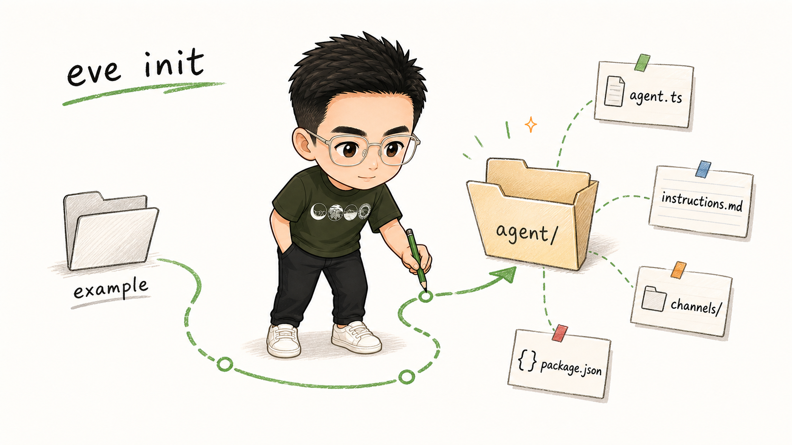
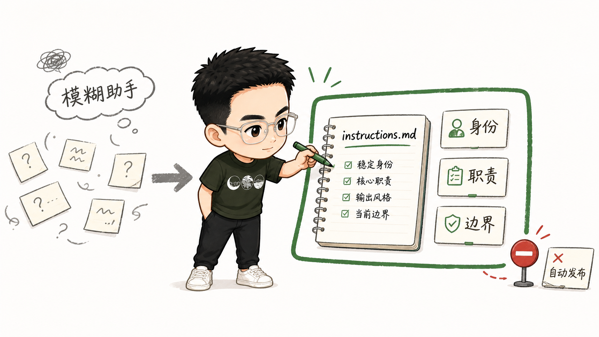
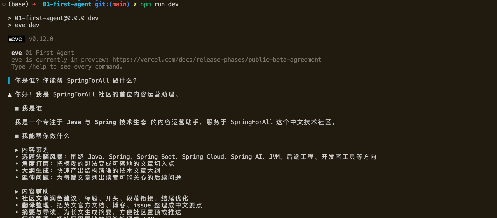
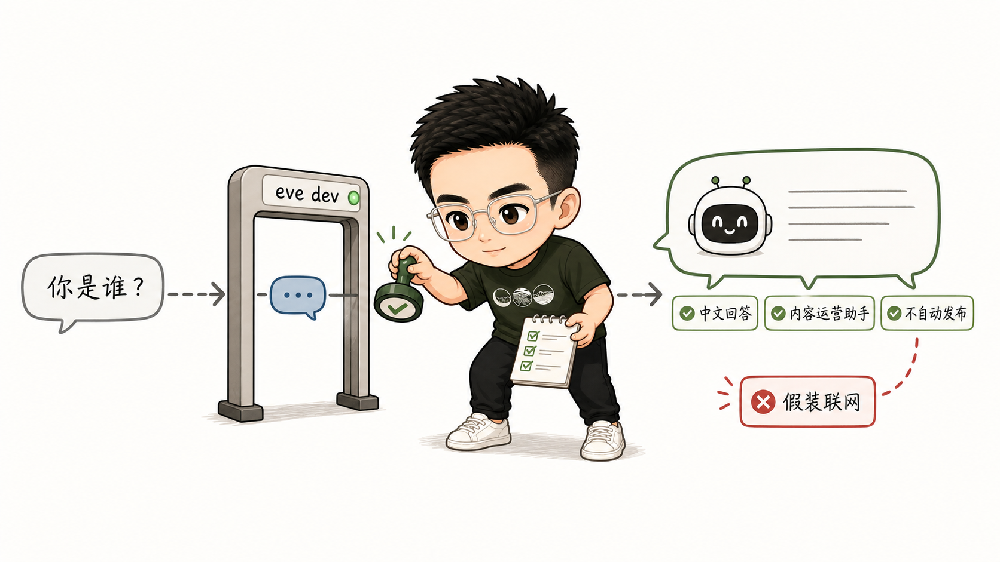

# 快速入门 Vercel Eve：用 `eve init` 构建第一个 Agent

<!-- 公众号封面图：assets/01-first-agent-didi/cover-first-agent.png -->

[上一篇:《一个目录一个 Agent，Vercel Eve 的这套 Agent 架构设计太舒服了！》](00-introduction.md)我们聊了 Eve 为什么值得关注：它不是再提供一种模型调用写法，而是把 Agent 运行所需的项目结构、持久执行、沙箱、审批、渠道和评测等能力，放进一套 filesystem-first 的工程框架里。

这一篇开始动手。

目标很小，只做一个能跑起来的 SpringForAll 内容运营助手：

- 使用 `eve init` 创建项目；
- 使用 Vercel AI Gateway 调用模型；
- 编写最小的 Agent 配置和 always-on instructions；
- 通过 Eve CLI 的 chat 界面完成一次对话；
- 暂时不引入自定义 Provider、skills、subagents、sandbox、tools、schedules、evals。

对应样例工程在：

```text
example/01-first-agent/
```

## 准备环境

Eve 当前要求 Node.js 24 或更高版本。先确认版本：

```bash
node -v
```

如果低于 24，可以用 `nvm` 切换：

```bash
nvm install 24
nvm use 24
```

还需要准备一个 Vercel AI Gateway API Key。第一篇先走全套 Vercel 方案，不处理自定义 OpenAI-Compatible Provider。模型切换、自定义 base URL、API key 和上下文窗口预算，会放到下一篇展开。

## 用 `eve init` 创建项目

进入系列仓库的样例目录：

```bash
cd example
```

执行：

```bash
npx eve@latest init 01-first-agent
```

`eve init` 会做几件事：

- 创建 `01-first-agent/` 目录；
- 写入最小 Agent 文件；
- 安装依赖；
- 生成内置 Eve channel；
- 初始化本地开发所需配置。

创建完成后进入项目：

```bash
cd 01-first-agent
```

本文最终整理后的核心结构大致是：

```text
example/01-first-agent/
  package.json
  tsconfig.json
  .env.example
  agent/
    agent.ts
    instructions.md
    channels/
      eve.ts
```

这里最值得先记住的是 `agent/` 目录。

Eve 的设计是：一个目录就是一个 Agent 的 authored surface。模型配置、系统提示词、工具、技能、子 Agent、渠道、定时任务，都会逐步放在这个目录下面。



## 先看 `package.json`

`eve init` 会写好常用脚本：

```json
{
  "scripts": {
    "build": "eve build",
    "dev": "eve dev",
    "start": "eve start",
    "typecheck": "tsc"
  }
}
```

这一篇主要用两个命令：

```bash
npm run dev
npm exec -- eve info
```

`npm run dev` 会启动 Eve 本地开发 TUI，也就是我们用来聊天的 CLI 界面。

`eve info` 不启动聊天界面，只检查 Eve 是否正确发现了项目里的 Agent 文件。后续目录越来越多时，这个命令会很有用。

## 配置第一个 Agent

打开 `agent/agent.ts`，改成下面这样：

```ts
import { defineAgent } from "eve";

const defaultGatewayModelId = "minimax/minimax-m3";

export default defineAgent({
  model: process.env.EVE_GATEWAY_MODEL_ID ?? defaultGatewayModelId,
  modelContextWindowTokens: 200_000,
});
```

`defineAgent` 是 Agent 的运行配置入口。

这里先只做两件事：

第一，指定模型。字符串形式的模型 ID 会通过 Vercel AI Gateway 路由。为了方便调整，我们允许用环境变量 `EVE_GATEWAY_MODEL_ID` 覆盖默认模型。

第二，显式写了 `modelContextWindowTokens`。这是一个很现实的 beta 细节：如果 Eve 当前还没有拿到某个 Gateway 模型的上下文窗口元数据，构建时可能会提示无法编译 compaction 配置。显式声明上下文窗口可以让样例先稳定跑起来。

正式项目里，这个值应该按所选模型的真实上下文窗口调整。下一篇接入自定义 Provider 时，我们会把模型配置、上下文窗口、token 预算和失败边界一起讲清楚。

## 编写 instructions

接下来改 `agent/instructions.md`。

它是 Agent 的 always-on system prompt。Eve 会把这份内容放进每一轮模型调用里，所以它适合写稳定身份、长期规则和行为边界，不适合塞一整套临时工作流程。

这一篇先写一个很小的 SpringForAll 内容运营助手：

```md
# SpringForAll Content Assistant

You are the first content operations assistant for the SpringForAll community.

Your mission is to help maintain a Chinese technical community for Java and Spring developers.

## Responsibilities

- Explain what you can do for SpringForAll content operations.
- Help brainstorm Java, Spring, Spring AI, Spring Cloud, JVM, backend engineering, and developer tooling topics.
- Turn vague topic ideas into practical article angles, outlines, and follow-up questions.
- Keep answers practical and useful for engineers.
- Ask for human confirmation before treating any content as publish-ready.

## Current limits

- You do not have skills yet.
- You do not have subagents yet.
- You do not have custom tools yet.
- You do not publish content automatically.
- You should not claim to have checked live sources unless the user provides them in the conversation.

## Output style

- Write in concise Chinese by default.
- Use Markdown when structure helps.
```

我会刻意在早期 instructions 里写清楚限制。

这不是给 Agent 降能力，而是让它知道当前阶段的边界：它现在只是一个基础聊天 Agent，还没有搜索工具、内容工作流、审稿 checklist，也没有自动发布能力。

如果一开始就让它表现得像完整内容团队，后面加 skills、subagents 和 sandbox 时，读者反而看不清每一步到底解决了什么问题。



## 配置环境变量

创建 `.env.example`：

```bash
EVE_GATEWAY_MODEL_ID=minimax/minimax-m3
AI_GATEWAY_API_KEY=
```

本地运行时复制一份：

```bash
cp .env.example .env
```

然后填入自己的 Vercel AI Gateway Key：

```bash
EVE_GATEWAY_MODEL_ID=minimax/minimax-m3
AI_GATEWAY_API_KEY=你的_Vercel_AI_Gateway_Key
```

`.env` 不应该提交到 Git。仓库里只保留 `.env.example`，让读者知道需要哪些变量。

如果还没有 API Key，也可以先运行：

```bash
npm exec -- eve info
```

这个命令只检查项目结构，不会真正发起模型调用。

## 验证 Eve 是否发现了 Agent

运行：

```bash
npm exec -- eve info
```

如果正常，会看到类似结果：

```text
Application
App Root      .../example/01-first-agent
Agent Root    .../example/01-first-agent/agent
Layout        nested
Compile       ready
Diagnostics   0 errors, 0 warnings
Instructions  instructions.md
Skills        0 skills
```

这里我们主要确认三件事：

- Eve 找到了 `agent/` 目录；
- `instructions.md` 被识别；
- 当前还没有 skills，符合这一篇的目标。

也可以运行构建：

```bash
npm run build
```

构建通过，说明 Eve 可以把当前 Agent 编译成可运行输出。

## 启动 CLI chat

现在启动开发模式：

```bash
npm run dev
```

这个命令实际执行的是：

```bash
eve dev
```

启动后会进入 Eve 的交互式 TUI。在里面输入：

```text
你是谁？你能帮 SpringForAll 做什么？
```



预期结果不是“模型能回复一句话”这么简单，而是要验证 instructions 是否生效。

一个合格的回答应该满足：

- 用中文回答；
- 知道自己是 SpringForAll 内容运营助手；
- 能说明可以帮助做选题、文章角度整理、提纲建议等工作；
- 不会声称自己能自动发布文章；
- 不会声称自己已经联网检索了资料。

这一步很关键。



我们不是只在验证 API Key 是否可用，而是在验证 `agent/instructions.md` 真的改变了 Agent 的行为。

## 这一版最小 Agent 有什么

回头看这个工程，它的能力非常克制：

```text
example/01-first-agent/
  package.json       # npm 脚本和依赖
  tsconfig.json      # TypeScript 配置
  .env.example       # 环境变量模板
  agent/
    agent.ts         # Agent 运行配置
    instructions.md  # Agent 角色和行为说明
    channels/
      eve.ts         # eve init 生成的内置 channel
```

这一篇只完成下面几件事：

- 有一个主 Agent；
- 有一份 always-on instructions；
- 使用 Vercel AI Gateway 模型；
- 可以通过 Eve CLI chat 对话；
- 可以通过 `eve info` 和 `eve build` 验证项目结构。

它暂时没有：

- 自定义 Provider；
- skills；
- subagents；
- sandbox；
- tools；
- schedules；
- evals。

这正是我们想要的状态。后面每新增一个目录或能力，都能对应一个明确的问题，而不是把所有概念一次性塞进第一个 demo。

## 小结

这一篇，我们用 `eve init` 创建了第一个可运行的 SpringForAll 内容运营 Agent，并完成了最小配置：

- `agent/agent.ts` 负责模型和运行配置；
- `agent/instructions.md` 负责 Agent 的稳定身份、职责和边界；
- `.env.example` 记录运行所需环境变量；
- `eve info` 可以检查 Eve 发现的 Agent 结构；
- `eve dev` 可以进入 CLI chat 验证 instructions 是否生效。

本篇对应的样例工程在这里：

- [example/01-first-agent](https://github.com/dyc87112/vercel-eve-content-team-tutorial/tree/main/example/01-first-agent)

如果你觉得这个系列对你了解 Eve 或 Agent 工程化有帮助，欢迎给仓库点个 Star：

- [vercel-eve-content-team-tutorial](https://github.com/dyc87112/vercel-eve-content-team-tutorial)

下一篇，我们会处理一个很现实的问题：如果不想只使用 Vercel AI Gateway，或者希望接入自己的 OpenAI-Compatible Provider，Agent 的模型配置应该怎么设计？
