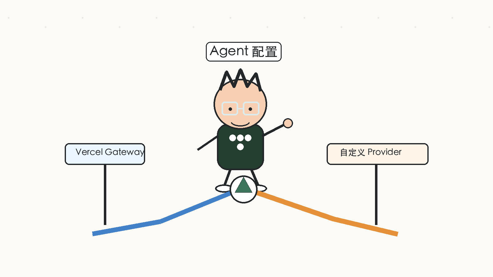
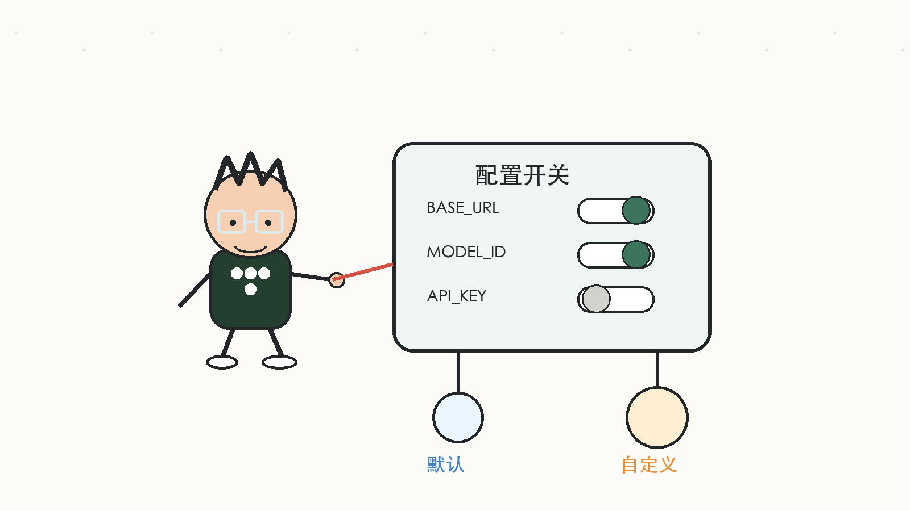
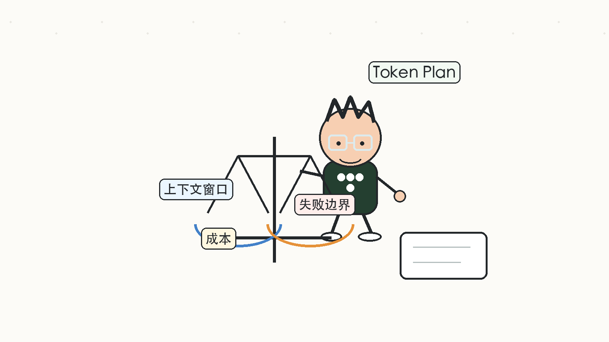

# Vercel Eve 接入自定义 AI Provider：别让 Agent 被模型入口绑死

[上一篇:《快速入门 Vercel Eve：用 `eve init` 构建第一个 Agent》](01-first-agent.md)我们做了一个非常克制的 SpringForAll 内容运营助手：只有主 Agent、模型配置、always-on instructions 和 Eve CLI chat。

这一篇继续往前走一步。

我们不急着加 skills、subagents、sandbox，也不急着把它包装成完整内容团队。先处理一个更基础、也更现实的问题：

> 如果不想只走 Vercel AI Gateway，或者希望接入自己的 OpenAI-Compatible Provider，Eve Agent 的模型配置应该怎么设计？

对应样例工程在：

```text
example/02-custom-provider/
```

这一篇的目标是：

- 默认仍然使用 Vercel AI Gateway；
- 当配置了自定义 `baseURL` 时，切换到 OpenAI-Compatible Provider；
- 显式配置模型上下文窗口；
- 增加一个独立检查脚本，在启动 Eve 之前先验证自定义 gateway；
- 借这个小改动，引入 coding plan 和 token plan 的工程意识。

## 为什么第二篇就要处理 Provider

第一篇里，我们直接让 Eve 使用 Vercel AI Gateway：

```ts
export default defineAgent({
  model: process.env.EVE_GATEWAY_MODEL_ID ?? "minimax/minimax-m3",
  modelContextWindowTokens: 200_000,
});
```

这对快速开始很友好。

但只要把 Agent 放到稍微真实一点的团队场景，模型入口很快就不只是一个字符串了。

内容运营 Agent 可能会遇到这些情况：

- 团队已经有统一的 OpenAI-Compatible gateway；
- 不同环境要使用不同模型；
- 某些模型还没有被 Vercel AI Gateway 收录；
- 同一个 Agent 在本地试验、CI、部署环境里的 key 不同；
- 长文章、研究笔记和审稿上下文会快速吃掉 token；
- 模型失败时，需要知道是鉴权、base URL、模型 ID、流式输出还是 usage 返回出了问题。

所以这一篇要做的不是「换一个模型调用库」。

真正要建立的是一个习惯：**Agent 在开始变复杂之前，先把模型入口、上下文窗口和失败边界显式化。**



## 第 02 个样例结构

这一篇的样例仍然很小：

```text
example/02-custom-provider/
  package.json
  tsconfig.json
  .env.example
  scripts/
    check-custom-gateway.mjs
  agent/
    agent.ts
    instructions.md
    channels/
      eve.ts
```

和第一篇相比，只增加两件事：

- `agent/agent.ts` 支持 Vercel AI Gateway 和自定义 Provider 两条路径；
- `scripts/check-custom-gateway.mjs` 用来提前检查自定义 gateway。

注意，这一版仍然没有：

- skills；
- subagents；
- sandbox；
- tools；
- schedules；
- evals。

这是刻意保留的边界。Provider 配置还没讲清楚之前，先不要把 Agent 工作流做复杂。

## 安装依赖

自定义 OpenAI-Compatible Provider 使用 `@ai-sdk/openai-compatible`：

```json
{
  "dependencies": {
    "@ai-sdk/openai-compatible": "^2.0.51",
    "@vercel/connect": "0.2.2",
    "ai": "7.0.0-beta.178",
    "eve": "^0.12.0",
    "zod": "4.4.3"
  }
}
```

`package.json` 里增加一个脚本：

```json
{
  "scripts": {
    "build": "eve build",
    "dev": "eve dev",
    "start": "eve start",
    "typecheck": "tsc",
    "check:gateway": "node scripts/check-custom-gateway.mjs"
  }
}
```

`check:gateway` 不属于 Eve 的必需脚本，但我建议在接入自定义 provider 时保留它。

原因很简单：不要等 `eve dev` 启动后才发现模型入口不通。先用一个最小请求把 base URL、模型 ID、API key 和流式返回检查掉，排障会轻很多。

## 设计环境变量

这一篇的 `.env.example` 分成两组。

默认路径仍然是 Vercel AI Gateway：

```bash
EVE_GATEWAY_MODEL_ID=minimax/minimax-m3
AI_GATEWAY_API_KEY=
```

自定义 OpenAI-Compatible Provider 使用另一组变量：

```bash
EVE_MODEL_BASE_URL=https://api.example.com/v1
EVE_MODEL_API_KEY=your-api-key
EVE_MODEL_ID=your-model-id
EVE_MODEL_CONTEXT_WINDOW_TOKENS=128000
```

这里的开关规则非常直接：

> 只要 `EVE_MODEL_BASE_URL` 非空，就使用自定义 Provider；否则继续使用 Vercel AI Gateway。



这样做有一个好处：默认路径足够简单，读者只配置 Vercel AI Gateway 就能继续跑；需要自定义 provider 的读者，也不需要改代码，只改环境变量。

## 改造 `agent/agent.ts`

完整代码如下：

```ts
import { createOpenAICompatible } from "@ai-sdk/openai-compatible";
import { defineAgent } from "eve";

const defaultGatewayModelId = "minimax/minimax-m3";
const customBaseURL = process.env.EVE_MODEL_BASE_URL;
const usesCustomGateway = customBaseURL !== undefined && customBaseURL.trim() !== "";

function parseContextWindowTokens(value: string | undefined) {
  if (value === undefined || value.trim() === "") {
    return 128000;
  }

  const parsed = Number(value);
  if (!Number.isInteger(parsed) || parsed <= 0) {
    throw new Error("EVE_MODEL_CONTEXT_WINDOW_TOKENS must be a positive integer.");
  }

  return parsed;
}

function requireCustomModelId() {
  const modelId = process.env.EVE_MODEL_ID;
  if (modelId === undefined || modelId.trim() === "") {
    throw new Error("EVE_MODEL_ID is required when EVE_MODEL_BASE_URL is set.");
  }

  return modelId;
}

const model = usesCustomGateway
  ? createOpenAICompatible({
      name: "custom",
      baseURL: customBaseURL,
      apiKey: process.env.EVE_MODEL_API_KEY,
      includeUsage: true,
    }).chatModel(requireCustomModelId())
  : (process.env.EVE_GATEWAY_MODEL_ID ?? defaultGatewayModelId);

const modelContextWindowTokens = parseContextWindowTokens(process.env.EVE_MODEL_CONTEXT_WINDOW_TOKENS);

export default defineAgent({
  model,
  modelContextWindowTokens,
});
```

这个文件只做三件事。

第一，判断模型路径。

```ts
const usesCustomGateway = customBaseURL !== undefined && customBaseURL.trim() !== "";
```

第二，当使用自定义 provider 时，显式要求 `EVE_MODEL_ID`。

```ts
if (modelId === undefined || modelId.trim() === "") {
  throw new Error("EVE_MODEL_ID is required when EVE_MODEL_BASE_URL is set.");
}
```

第三，显式配置上下文窗口。

```ts
const modelContextWindowTokens = parseContextWindowTokens(process.env.EVE_MODEL_CONTEXT_WINDOW_TOKENS);
```

这里默认值是 `128000`。它不是一个放之四海皆准的标准值，只是样例里的保守默认。

真实项目里，应该按所选模型的官方上下文窗口来填。比如一个模型只有 32K 上下文，你不能在这里写 200K，然后期待它真的能吞下 200K token。

## 为什么上下文窗口要显式写

Eve 需要知道模型上下文窗口，才能做 compaction 和上下文管理。

对于 Vercel AI Gateway 中已经有元数据的模型，框架可能可以自动识别。但在 beta 阶段，或者接入自定义 Provider 时，模型元数据不一定完整。

这时候与其让构建阶段报一个不容易定位的问题，不如在 Agent 配置里明确写出来：

```bash
EVE_MODEL_CONTEXT_WINDOW_TOKENS=128000
```

这也是 token plan 的起点。

内容运营 Agent 后面会处理选题、研究资料、文章草稿和审稿意见。上下文窗口不是越大越好，它至少会影响三件事：

- 一次任务最多能塞多少上下文；
- 长上下文带来的成本和延迟；
- 当上下文不够时，哪些内容应该被压缩、丢弃或让用户重新确认。



所以这里不要把 `modelContextWindowTokens` 当成纯配置项。

它其实是在提醒我们：**Agent 的能力边界，部分来自模型，部分来自你愿意为上下文支付多少成本。**

## 增加 gateway 检查脚本

接下来写 `scripts/check-custom-gateway.mjs`。

它做的事情很简单：

- 读取 `.env.local`；
- 检查 `EVE_MODEL_BASE_URL`；
- 检查 `EVE_MODEL_ID`；
- 请求 `${baseURL}/chat/completions`；
- 发送一个最小消息：`Say OK.`；
- 可选检查 stream 和 usage。

核心请求是：

```js
const endpoint = `${baseURL.replace(/\/+$/, "")}/chat/completions`;

const response = await fetch(endpoint, {
  method: "POST",
  headers: {
    "content-type": "application/json",
    ...(apiKey ? { authorization: `Bearer ${apiKey}` } : {}),
  },
  body: JSON.stringify({
    model,
    messages: [{ role: "user", content: "Say OK." }],
    stream,
    ...(stream && includeUsage ? { stream_options: { include_usage: true } } : {}),
    max_tokens: 8,
  }),
});
```

检查普通响应：

```bash
npm run check:gateway
```

检查流式输出：

```bash
npm run check:gateway -- --stream
```

如果你的 gateway 支持流式 usage：

```bash
npm run check:gateway -- --stream --include-usage
```

这一步不是为了证明 Agent 行为正确，而是为了先把模型入口的低级问题排除掉。

如果这里都无法返回 `OK`，后面 `eve dev` 里看到的错误，大概率也不是 instructions 或 Agent 工作流的问题。

## 先验证程序

我本机默认 Node 是 `v22.22.0`，而 Eve 要求 Node.js 24 或更高版本。所以验证时需要先把 Node 24 放到 `PATH` 前面：

```bash
PATH=/Users/zhaiyongchao/.nvm/versions/node/v24.11.1/bin:$PATH npm install
```

然后检查 Eve 是否能发现 Agent：

```bash
PATH=/Users/zhaiyongchao/.nvm/versions/node/v24.11.1/bin:$PATH npm exec -- eve info
```

结果里可以看到：

```text
Compile       ready
Diagnostics   0 errors, 0 warnings
Instructions  instructions.md
Skills        0 skills
```

这说明 Eve 找到了第 02 个样例的 `agent/` 目录，instructions 正常识别，并且仍然没有 skills，符合这一篇的边界。

再运行构建：

```bash
PATH=/Users/zhaiyongchao/.nvm/versions/node/v24.11.1/bin:$PATH npm run build
```

构建通过，并且产物里可以看到自定义 provider 依赖已经被打进去：

```text
.output/server/_libs/@ai-sdk/openai-compatible+[...].mjs
[BUILD] built output at .../example/02-custom-provider/.output
```

最后补两个错误路径。

如果设置了 `EVE_MODEL_BASE_URL`，但没有设置 `EVE_MODEL_ID`：

```bash
EVE_MODEL_BASE_URL=https://api.example.com/v1 npm exec -- eve info
```

会得到：

```text
EVE_MODEL_ID is required when EVE_MODEL_BASE_URL is set.
```

如果上下文窗口不是正整数：

```bash
EVE_MODEL_CONTEXT_WINDOW_TOKENS=abc npm exec -- eve info
```

会得到：

```text
EVE_MODEL_CONTEXT_WINDOW_TOKENS must be a positive integer.
```

这些报错很朴素，但很有用。

Agent 工程里，最怕的是配置错了以后变成模型调用失败、流式输出断开、甚至运行中才暴露异常。能在启动阶段说清楚，就不要把问题留到对话阶段。

## 这里的 Coding Plan 是什么

这一篇代码不多，但它背后其实有一个很小的 coding plan：

```text
目标：让 Agent 支持两种模型入口

默认路径：
  EVE_GATEWAY_MODEL_ID + AI_GATEWAY_API_KEY
  -> Vercel AI Gateway

自定义路径：
  EVE_MODEL_BASE_URL + EVE_MODEL_API_KEY + EVE_MODEL_ID
  -> OpenAI-Compatible Provider

验证：
  eve info
  eve build
  check-custom-gateway
  错误配置提示
```

这就是我想在系列里持续保留的习惯。

写 Agent 不是只写 prompt。每新增一个能力，都应该先回答：

- 入口是什么；
- 配置在哪里；
- 失败时怎么提示；
- 怎么在不启动完整工作流的情况下验证；
- 哪些能力暂时不做。

这一篇的 coding plan 很小，但后面加 skills、subagents、sandbox 时，这个习惯会越来越重要。

## 这里的 Token Plan 是什么

Token plan 也不是复杂表格。

在这个阶段，它至少包含三件事：

第一，知道当前模型的上下文窗口。

```bash
EVE_MODEL_CONTEXT_WINDOW_TOKENS=128000
```

第二，知道内容运营任务未来会吃哪些上下文。

比如：

- 用户给的选题方向；
- 搜集到的来源材料；
- researcher 的判断；
- writer 的草稿；
- reviewer 的修改意见；
- 主 Agent 的总结和下一步问题。

第三，知道上下文不够时不能硬塞。

后面真正做内容团队时，我们会更明确地把长资料放进 sandbox，把工作流拆到 skill 和 subagent 中，让每个角色只拿自己需要的上下文。

但在这之前，先把模型上下文窗口写成一个明确配置，就是最小 token plan。

## 小结

这一篇，我们把第一个 Agent 演进成了一个支持两条模型路径的 Agent：

- 默认继续使用 Vercel AI Gateway；
- 配置 `EVE_MODEL_BASE_URL` 后切换到自定义 OpenAI-Compatible Provider；
- 使用 `EVE_MODEL_CONTEXT_WINDOW_TOKENS` 显式声明上下文窗口；
- 用 `check-custom-gateway.mjs` 在启动 Eve 前检查自定义模型入口；
- 用 `eve info`、`eve build` 和错误路径验证，确认程序可运行。

本篇对应的样例工程在这里：

- [example/02-custom-provider](https://github.com/dyc87112/vercel-eve-content-team-tutorial/tree/main/example/02-custom-provider)

如果你觉得这个系列对你了解 Eve 或 Agent 工程化有帮助，欢迎给仓库点个 Star：

- [vercel-eve-content-team-tutorial](https://github.com/dyc87112/vercel-eve-content-team-tutorial)

下一篇，我们会开始把内容运营流程拆出来：用 skills 沉淀选题、写作和审稿方法，再用 subagents 让 researcher、writer、reviewer 各自承担清晰职责。
