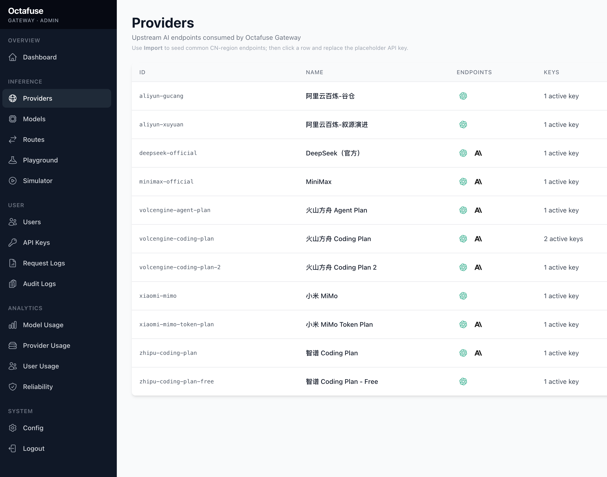

# Vercel Eve 接入自定义 AI Provider：别让 Agent 被模型入口绑死

[上一篇:《快速入门 Vercel Eve：用 `eve init` 构建第一个 Agent》](01-first-agent.md)我们做了一个极简的 SpringForAll 内容运营助手：只有主 Agent、模型配置、常驻 instructions（系统提示词）和 Eve CLI chat。

相信很多朋友跟我一样，手头都有不少 coding plan、token plan 相关的资源。真正使用 Agent 时，也不一定会直接使用 Vercel AI Gateway，接入第三方 Provider 是个很常见的需求。

比如我自己一直在用开源的 [Octafuse Gateway](https://github.com/OctaFuse/octafuse-gateway) 管理我手头所有的 API 资源，包括各种 Coding Plan/Token Plan。



这样做的好处是模型供应商、key、路由和成本策略可以统一收口，业务项目只需要接一个 OpenAI-Compatible 入口。

所以，这一篇不急着加 skills、subagents、sandbox。先处理一个更基础的问题：

> 如果不想只走 Vercel AI Gateway，或者希望接入自己的 OpenAI-Compatible Provider，Eve Agent 的模型配置应该怎么实现？

目标是：

- 默认仍然使用 Vercel AI Gateway；
- 当配置了自定义 `baseURL` 时，切换到 OpenAI-Compatible Provider；
- 显式配置模型上下文窗口；
- 增加一个独立检查脚本，在启动 Eve 之前先验证自定义 gateway；
- 把 coding plan 和 token plan 放进模型配置设计里。

第一篇里，我们直接让 Eve 使用 Vercel AI Gateway：

```ts
export default defineAgent({
  model: process.env.EVE_GATEWAY_MODEL_ID ?? "minimax/minimax-m3",
  modelContextWindowTokens: 200_000,
});
```

这对快速开始很友好。但现在我们要把模型入口从一个 Gateway 模型 ID，改成一套可切换配置：默认继续走 Vercel AI Gateway；配置了自己的 OpenAI-Compatible gateway，就切到自定义 Provider。

核心习惯也很简单：**Agent 在开始变复杂之前，先把模型入口、上下文窗口和失败边界显式化。**

## 第 02 个样例结构

样例结构如下：

```text
example/02-custom-provider/
  package.json
  tsconfig.json
  .env.example
  scripts/
    check-custom-gateway.mjs
  agent/
    agent.ts
    instructions.md
    channels/
      eve.ts
```

和第一篇相比，只增加两件事：

- `agent/agent.ts` 支持 Vercel AI Gateway 和自定义 Provider 两条路径；
- `scripts/check-custom-gateway.mjs` 用来提前检查自定义 gateway。

这一版仍然没有：

- skills；
- subagents；
- sandbox；
- tools；
- schedules；
- evals。

先把 Provider 配置讲清楚，再继续扩展 Agent 工作流。

## 安装依赖

自定义 OpenAI-Compatible Provider 使用 `@ai-sdk/openai-compatible`：

```json
{
  "dependencies": {
    "@ai-sdk/openai-compatible": "^2.0.51",
    "@vercel/connect": "0.2.2",
    "ai": "7.0.0-beta.178",
    "eve": "^0.12.0",
    "zod": "4.4.3"
  }
}
```

`package.json` 里增加一个脚本：

```json
{
  "scripts": {
    "build": "eve build",
    "dev": "eve dev",
    "start": "eve start",
    "typecheck": "tsc",
    "check:gateway": "node scripts/check-custom-gateway.mjs"
  }
}
```

`check:gateway` 不属于 Eve 的必需脚本，但接入自定义 provider 时很有用：它可以在启动 `eve dev` 之前，先用最小请求检查 base URL、模型 ID、API key 和流式返回。

## 设计环境变量

`.env.example` 分成两组。默认路径仍然是 Vercel AI Gateway：

```bash
EVE_GATEWAY_MODEL_ID=minimax/minimax-m3
AI_GATEWAY_API_KEY=
```

自定义 OpenAI-Compatible Provider 使用另一组变量：

```bash
EVE_MODEL_BASE_URL=https://api.example.com/v1
EVE_MODEL_API_KEY=your-api-key
EVE_MODEL_ID=your-model-id
EVE_MODEL_CONTEXT_WINDOW_TOKENS=128000
```

开关规则很直接：只要 `EVE_MODEL_BASE_URL` 非空，就使用自定义 Provider；否则继续使用 Vercel AI Gateway。

这样默认路径足够简单：只配置 Vercel AI Gateway 就能跑；需要自定义 provider 时，也只改环境变量，不改代码。

## 改造 `agent/agent.ts`

完整代码如下：

```ts
import { createOpenAICompatible } from "@ai-sdk/openai-compatible";
import { defineAgent } from "eve";

const defaultGatewayModelId = "minimax/minimax-m3";
const customBaseURL = process.env.EVE_MODEL_BASE_URL;
const usesCustomGateway = customBaseURL !== undefined && customBaseURL.trim() !== "";

function parseContextWindowTokens(value: string | undefined) {
  if (value === undefined || value.trim() === "") {
    return 128000;
  }

  const parsed = Number(value);
  if (!Number.isInteger(parsed) || parsed <= 0) {
    throw new Error("EVE_MODEL_CONTEXT_WINDOW_TOKENS must be a positive integer.");
  }

  return parsed;
}

function requireCustomModelId() {
  const modelId = process.env.EVE_MODEL_ID;
  if (modelId === undefined || modelId.trim() === "") {
    throw new Error("EVE_MODEL_ID is required when EVE_MODEL_BASE_URL is set.");
  }

  return modelId;
}

const model = usesCustomGateway
  ? createOpenAICompatible({
      name: "custom",
      baseURL: customBaseURL,
      apiKey: process.env.EVE_MODEL_API_KEY,
      includeUsage: true,
    }).chatModel(requireCustomModelId())
  : (process.env.EVE_GATEWAY_MODEL_ID ?? defaultGatewayModelId);

const modelContextWindowTokens = parseContextWindowTokens(process.env.EVE_MODEL_CONTEXT_WINDOW_TOKENS);

export default defineAgent({
  model,
  modelContextWindowTokens,
});
```

这个文件只做三件事：

- 判断 `EVE_MODEL_BASE_URL` 是否存在，决定走 Vercel AI Gateway 还是自定义 Provider；
- 使用自定义 provider 时，强制要求 `EVE_MODEL_ID`；
- 解析 `EVE_MODEL_CONTEXT_WINDOW_TOKENS`，并在配置非法时直接报错。

默认值 `128000` 只是样例里的保守默认。真实项目要按所选模型的官方上下文窗口来填。模型只有 32K 上下文，就不能写 200K 然后期待它真的吞下 200K token。

Eve 需要知道模型上下文窗口，才能做 compaction 和上下文管理。接入自定义 Provider 时，模型元数据不一定完整，所以这里直接明确写出来：

```bash
EVE_MODEL_CONTEXT_WINDOW_TOKENS=128000
```

这也是 token plan 的起点。

内容运营 Agent 后面会处理选题、研究资料、文章草稿和审稿意见。上下文窗口不是越大越好，它会影响：

- 一次任务最多能塞多少上下文；
- 长上下文带来的成本和延迟；
- 当上下文不够时，哪些内容应该被压缩、丢弃或让用户重新确认。

所以不要把 `modelContextWindowTokens` 当成纯配置项。它同时定义了 Agent 的上下文能力和成本边界。

## 验证自定义 gateway

接下来写 `scripts/check-custom-gateway.mjs`。它做几件事：

- 读取 `.env.local`；
- 检查 `EVE_MODEL_BASE_URL`；
- 检查 `EVE_MODEL_ID`；
- 请求 `${baseURL}/chat/completions`；
- 发送一个最小消息：`Say OK.`；
- 可选检查 stream 和 usage。

核心请求是：

```js
const endpoint = `${baseURL.replace(/\/+$/, "")}/chat/completions`;

const response = await fetch(endpoint, {
  method: "POST",
  headers: {
    "content-type": "application/json",
    ...(apiKey ? { authorization: `Bearer ${apiKey}` } : {}),
  },
  body: JSON.stringify({
    model,
    messages: [{ role: "user", content: "Say OK." }],
    stream,
    ...(stream && includeUsage ? { stream_options: { include_usage: true } } : {}),
    max_tokens: 8,
  }),
});
```

检查普通响应：

```bash
npm run check:gateway
```

检查流式输出：

```bash
npm run check:gateway -- --stream
```

检查流式 usage：

```bash
npm run check:gateway -- --stream --include-usage
```

这一步不是为了证明 Agent 行为正确，而是先排除模型入口问题。如果这里无法返回 `OK`，后面 `eve dev` 里的错误大概率也不是 instructions 或 Agent 工作流的问题。

## 启动 Chat 验证

确认依赖安装完成后，直接启动 Eve：

```bash
npm run dev
```

进入 CLI chat 后，可以问一句：

```text
你现在是什么角色？能帮 SpringForAll 做什么？
```

如果配置正确，Agent 会正常响应，并继续遵守 `agent/instructions.md` 里的边界：它是 SpringForAll 内容运营助手，可以辅助选题、提纲和内容规划，但不会声称自己已经具备搜索、发布、审稿团队等后续能力。

如果走自定义 Provider，可以先跑一次：

```bash
npm run check:gateway
```

这个脚本只是提前排除 base URL、模型 ID 和 API key 问题。真正的行为验证，还是以 `npm run dev` 进入 chat 后能正常对话为准。

## 小结

这一篇，我们把第一个 Agent 演进成了一个支持两条模型路径的 Agent：

- 默认继续使用 Vercel AI Gateway；
- 配置 `EVE_MODEL_BASE_URL` 后切换到自定义 OpenAI-Compatible Provider；
- 使用 `EVE_MODEL_CONTEXT_WINDOW_TOKENS` 显式声明上下文窗口；
- 用 `check-custom-gateway.mjs` 在启动 Eve 前检查自定义模型入口；
- 启动 `eve dev`，进入 CLI chat 确认程序可运行。

本篇对应的样例工程在这里：

- [example/02-custom-provider](https://github.com/dyc87112/vercel-eve-content-team-tutorial/tree/main/example/02-custom-provider)

如果你觉得这个系列对你了解 Eve 或 Agent 工程化有帮助，欢迎给仓库点个 Star：

- [vercel-eve-content-team-tutorial](https://github.com/dyc87112/vercel-eve-content-team-tutorial)

下一篇，我们会开始把内容运营流程拆出来：用 skills 沉淀选题、写作和审稿方法，再用 subagents 让 researcher、writer、reviewer 各自承担清晰职责。
