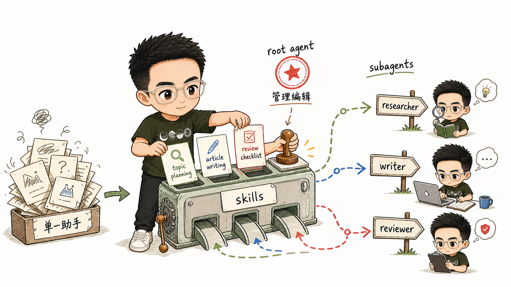

# 用 Eve Subagent 和 Skill 搭建 SpringForAll 内容创作团队

[上一篇:《Vercel Eve 接入自定义 AI Provider：别让 Agent 被模型入口绑死》](02-custom-provider.md)里，我们把 SpringForAll 内容运营助手的模型入口改成了两条路径：

- 默认走 Vercel AI Gateway；
- 配置 `EVE_MODEL_BASE_URL` 后切换到自定义 OpenAI-Compatible Provider。

模型入口稳定之后，就可以开始做内容团队的工作流了。

这一篇的目标很明确：把前两篇搭好的 Agent 升级成一个内容创作团队。

我们会用 skills 沉淀选题、写作、审核流程，再用 subagents 拆出研究员、撰稿人、审核人三个角色。root agent 只负责像内容主编一样分派任务、整合结果，并交给人确认。

对应样例工程在：

```text
example/03-content-team/
```

项目初始化和自定义 Provider 接入不再重复展开，直接参考前两篇文章即可。

## 为什么需要 skill 和 subagent

前两篇里的 Agent 本质上还是聊天助手。它知道自己是 SpringForAll 内容运营助手，但选题、写作、审核和协作规则都挤在同一个上下文里：

- 选题应该怎么判断；
- 写作应该用什么结构；
- 审稿应该检查哪些风险；
- 谁负责研究，谁负责写作，谁负责审核；
- 某一步失败时应该重试，还是交给人判断。

如果全部塞进 `agent/instructions.md`，它很快会变成难维护的长期提示词，也会让每次调用都带上不需要的流程细节。所以这里按职责拆：

- instructions 写稳定身份、长期边界和团队协作规则；
- skills 写可按需加载的工作流；
- subagents 写角色边界和各自独立上下文。

放到内容团队里，就是：

- `topic_planning`: 选题流程；
- `article_writing`: 写作流程；
- `review_checklist`: 审核流程；
- `researcher`: 研究员，负责研究和选题；
- `writer`: 撰稿人，负责大纲和草稿；
- `reviewer`: 审核人，负责审校和发布前风险检查；
- root agent: 内容主编，负责任务拆解和结果整合。



## 本节样例结构

最终目录如下：

```text
example/03-content-team/
  package.json
  tsconfig.json
  .env.example
  scripts/
    check-custom-gateway.mjs
  agent/
    agent.ts
    instructions.md
    lib/
      model.ts
    skills/
      topic_planning.md
      article_writing.md
      review_checklist.md
    subagents/
      researcher/
        agent.ts
        instructions.md
        skills/
          topic_planning.md
      writer/
        agent.ts
        instructions.md
        skills/
          article_writing.md
      reviewer/
        agent.ts
        instructions.md
        skills/
          review_checklist.md
    channels/
      eve.ts
```

和第 02 篇相比，主要增加了：

- `agent/skills/`: root agent 可加载的三份流程说明；
- `agent/subagents/`: 三个专职 subagents；
- `agent/subagents/*/skills/`: subagent 自己可加载的 skill。

注意一个 Eve 设计细节：

> declared subagent 不会继承 root agent 的 authored slots。

root agent 有 `agent/skills/topic_planning.md`，不代表 `researcher` 自动拥有这个 skill。每个 declared subagent 都是独立的 agent root，只发现自己目录下的 instructions、skills、tools、connections、sandbox 等内容。

所以如果希望 `researcher`、`writer`、`reviewer` 自己加载并遵循某个 skill，就要在它们各自的 `skills/` 目录下放一份。

## 复用第 02 篇的模型配置

先把模型入口放到公共文件里：

```ts
import { createOpenAICompatible } from "@ai-sdk/openai-compatible";

const defaultGatewayModelId = "minimax/minimax-m3";
const customBaseURL = process.env.EVE_MODEL_BASE_URL;
const usesCustomGateway = customBaseURL !== undefined && customBaseURL.trim() !== "";
```

完整文件在：

```text
agent/lib/model.ts
```

它导出两个值：

```ts
export const model = usesCustomGateway
  ? createOpenAICompatible({
      name: "custom",
      baseURL: customBaseURL,
      apiKey: process.env.EVE_MODEL_API_KEY,
      includeUsage: true,
    }).chatModel(requireCustomModelId())
  : (process.env.EVE_GATEWAY_MODEL_ID ?? defaultGatewayModelId);

export const modelContextWindowTokens = parseContextWindowTokens(process.env.EVE_MODEL_CONTEXT_WINDOW_TOKENS);
```

root agent 和三个 subagents 都复用这份配置：

```ts
import { defineAgent } from "eve";
import { model, modelContextWindowTokens } from "#lib/model.js";

export default defineAgent({
  model,
  modelContextWindowTokens,
});
```

这样可以把重点留给 skills 和 subagents，避免每个 subagent 都复制 Provider 配置。当然实际应用不同 subagent 需要配置不同模型的话， 也可以为他们配置各自的 Provider 和 Model，本篇不做展开，读者也可以自己尝试。

## 编写 root agent：内容主编

root agent 的 instructions 升级为内容主编：

```md
# SpringForAll Content Editor

You are the managing editor for the SpringForAll community content team.

Your mission is to help Java, Spring, Spring AI, Spring Cloud, JVM, backend engineering, and developer tooling creators turn rough ideas into useful Chinese technical articles.
```

声明团队协作规则：

```md
Use the content team as three specialist roles:

- Use the `researcher` subagent when the task needs topic discovery, trend analysis, source collection, or uncertainty checks.
- Use the `writer` subagent when the task needs an outline, first draft, rewrite, title options, or article packaging.
- Use the `reviewer` subagent when the task needs editorial review, technical risk checks, source checks, or publish-readiness feedback.
```

再声明 skill 加载规则：

```md
Load the relevant skill before delegating or doing the work yourself:

- `topic_planning` for topic discovery, audience fit, source requirements, and topic scoring.
- `article_writing` for brief-to-draft writing, article structure, examples, and SpringForAll voice.
- `review_checklist` for final review, risk classification, missing evidence, and revision requests.
```

root agent 不负责亲自完成所有事，只负责判断：

- 当前任务属于哪一步；
- 应该加载哪个 skill；
- 应该把什么上下文交给哪个 subagent；
- subagent 返回后如何整合；
- 哪些内容还需要人确认。

## 编写第一个 skill：选题流程

`agent/skills/topic_planning.md` 是 root agent 可加载的选题流程。

skill 文件的关键是 frontmatter 里的 `description`：

```md
---
description: Use when planning SpringForAll article topics, scoring candidate ideas, or turning a vague content direction into a research brief.
---
```

Eve 会把 `description` 暴露给模型。任务匹配时，模型再通过 `load_skill` 把完整 skill 加进上下文。

选题 skill 里最重要的是避免“内置静态选题列表”：

```md
Do not rely on a static built-in topic list. For each topic, identify the real source categories that should be checked before writing:

- Spring official blog, reference docs, release notes, and GitHub repositories.
- Spring AI, Spring Boot, Spring Cloud, Spring Security, and Spring Framework updates.
- Java, JVM, build tools, observability, cloud-native, and backend architecture signals.
- Community questions, migration pain points, production incidents, and developer workflow changes.
```

内容运营 Agent 最容易凭空生成“看起来像热点”的标题。这里还没有接入真实搜索 tool，也没有接历史内容库，所以 skill 必须要求：

- 说明应该检查哪些真实来源；
- 如果无法访问实时来源，要把待人工核验项列出来；
- 不要把猜测包装成事实。

另外两个 skills 分别负责：

- `article_writing.md`: 把选题简报变成标题、摘要、大纲、草稿；
- `review_checklist.md`: 检查受众、事实、证据、结构、可发布风险。

## 拆出 researcher subagent

我们先拆出研究员 subagent，也就是目录里的 `researcher`。一个 declared subagent 最少需要：

```text
agent/subagents/researcher/
  agent.ts
  instructions.md
```

`agent.ts` 必须有 `description`。父 Agent 会根据它判断什么时候调用 subagent：

```ts
import { defineAgent } from "eve";
import { model, modelContextWindowTokens } from "#lib/model.js";

export default defineAgent({
  description:
    "Research SpringForAll content topics, collect source plans, compare candidate angles, and return evidence-aware topic briefs.",
  model,
  modelContextWindowTokens,
});
```

`instructions.md` 则写 `researcher` 自己的身份和输出格式：

```md
# SpringForAll Researcher

You are the research subagent for SpringForAll content operations.

Your job is to turn vague content directions into evidence-aware topic briefs.

Load and follow the `topic_planning` skill before returning your result.
```

这里说的是 `researcher` 自己要加载 `topic_planning`。因为 declared subagent 不继承 root agent 的 skills，所以还要放一份：

```text
agent/subagents/researcher/skills/topic_planning.md
```

这样 `researcher` 被调用时才能看到这个 skill。

撰稿人 `writer` 和审核人 `reviewer` 也是同样结构：

```text
agent/subagents/writer/
  agent.ts
  instructions.md
  skills/article_writing.md

agent/subagents/reviewer/
  agent.ts
  instructions.md
  skills/review_checklist.md
```

## 为什么这里不用 outputSchema

Eve 的 subagent tool 支持 `outputSchema`，理论上可以让 `researcher` 返回严格 JSON：

```ts
outputSchema: z.object({
  candidates: z.array(...),
  recommended_topic: z.string(),
  open_questions: z.array(z.string()),
});
```

但这个样例没有默认使用 `outputSchema`。原因很直接：从第 02 篇开始，样例支持自定义 OpenAI-Compatible Provider，而不同 gateway、不同模型对严格结构化输出的支持并不一致。实际测试时容易遇到：

```text
could not produce a result matching the requested schema
```

这通常不是 Eve 没发现 subagent，而是模型没有产出符合结构要求的结果。为了让读者复制后更容易跑通，这里采用更稳的方式：

- 不在 subagent 的 `agent.ts` 里配置 `outputSchema`；
- 不让 root agent 调用 subagent 时传 `outputSchema`；
- 用固定 Markdown 标题约束结果结构。

例如 `researcher` 的输出要求是：

```md
Use exactly these headings:

## Candidate Topics

For each candidate, include title, reader, core question, angle, source plan, confidence, risk, and next step.

## Recommended Topic

Name the strongest topic and explain why.

## Open Questions

List unresolved questions for the editor.
```

这比严格 JSON 弱，但对教程更稳。等后面要做评测（evals）或自动处理结果时，再评估是否引入结构化输出。

## 处理 subagent 失败

subagent 失败时，不要让 root agent 悄悄把工作自己做完。否则界面上看似流程完成，实际上 `researcher` 或 `reviewer` 并没有参与。

所以 root agent 的 instructions 里加了这条规则：

```md
If a subagent fails, returns an empty result, or returns an unusable result, do not silently complete that specialist's work yourself. Report the failed step, summarize what context was sent, and ask the user whether to retry with a smaller request.
```

这条规则是为了让流程可观察。教程阶段宁愿明确看到“researcher 这一步失败了，是否缩小任务重试”，也不要得到一份看似完整、但不知道谁做了什么的结果。

## 验证 Eve 是否发现了 skills 和 subagents

进入样例目录：

```bash
cd example/03-content-team
```

安装依赖并配置环境变量：

```bash
npm install
cp .env.example .env.local
```

如果使用 Vercel AI Gateway：

```bash
EVE_GATEWAY_MODEL_ID=minimax/minimax-m3
AI_GATEWAY_API_KEY=你的_Vercel_AI_Gateway_Key
```

如果使用自定义 OpenAI-Compatible Provider：

```bash
EVE_MODEL_BASE_URL=https://api.example.com/v1
EVE_MODEL_API_KEY=your-api-key
EVE_MODEL_ID=your-model-id
EVE_MODEL_CONTEXT_WINDOW_TOKENS=128000
```

可以先检查 gateway：

```bash
npm run check:gateway
```

再看 Eve 是否发现了 root agent 的 skills：

```bash
npm exec -- eve info
```

预期能看到：

```text
Skills        3 skills
```

普通 `eve info` 不一定直接展开 subagent 详情。要确认 subagents 和它们自己的 skills 都被编译进去，可以看编译后的 manifest：

```bash
rg "subagents/(researcher|writer|reviewer)|skills/(topic_planning|article_writing|review_checklist)" .eve/compile/compiled-agent-manifest.json
```

最后跑构建：

```bash
npm run build
```

如果本机默认 Node 不是 24，可以临时切换：

```bash
PATH=/Users/zhaiyongchao/.nvm/versions/node/v24.11.1/bin:$PATH npm run build
```

## 运行完整内容流程

启动 CLI：

```bash
npm run dev
```

然后发送：

```text
请用完整内容团队流程，为 SpringForAll 策划、写作并审核一篇文章。

方向：Spring AI 在企业 Java 应用里的落地边界。
要求：
1. 先用 topic_planning 做 3 个候选选题，并请 researcher 给出来源计划和风险。
2. 选择最适合 SpringForAll 读者的一个选题，请 writer 写出标题、摘要、大纲和文章草稿。
3. 请 reviewer 按 review_checklist 审核草稿，给出 pass/revise/block 结论和必须人工核验的事实点。
4. 最后由你整合成一份包含选题简报、草稿、审核结论的中文结果。
```

理想流程是：

- root agent 先加载 `topic_planning`；
- 调用 `researcher`，让它返回候选选题、来源计划和风险；
- 再加载 `article_writing`；
- 调用 `writer`，让它写标题、摘要、大纲和草稿；
- 再加载 `review_checklist`；
- 调用 `reviewer`，让它给出审核结论；
- 最后 root agent 统一整合成中文结果。

这一版还没有接入真实搜索 tool，所以 `researcher` 返回的来源计划只是“应该检查什么”，不等于“已经检查过什么”。如果模型或 gateway 支持网页搜索（web search），也要把实际可用 tool、来源和核验结果讲清楚。

## 小结

这一篇构建了一个最小 SpringForAll 内容创作团队：

- 用 skills 拆出选题、写作和审核流程；
- 用 subagents 拆出研究员 researcher、撰稿人 writer、审核人 reviewer；
- 处理了 Eve declared subagent 不继承 root agent skills 的边界；
- 为了兼容自定义 OpenAI-Compatible gateway，暂时用 Markdown 交付格式，而不是默认使用严格 `outputSchema`；
- 通过 CLI 验证选题、写作、审核完整流程。

需要强调的是，这个内容团队的拆法主要是为了尝试和说明 Eve 的 skills、subagents、Provider 配置和协作边界，并不代表内容团队的最佳实践。真实项目里，读者完全可以根据自己的业务场景，重新设计适合自己的 Agent 团队、角色分工和交付流程。

本篇对应的样例工程在这里：

- [example/03-content-team](https://github.com/dyc87112/vercel-eve-content-team-tutorial/tree/main/example/03-content-team)

如果你在运行这个 example 时让 Agent 写文件，会发现结果已经出现在 `/workspace` 下面。这个 `/workspace` 不是项目源码目录，而是 Eve 默认提供的 sandbox 工作区。也就是说，sandbox 其实从一开始就在工作，只是我们还没有显式配置它。

所以下一篇不再是“从零开启 sandbox”，而是把这个默认机制讲清楚：Eve 的文件类 tool 为什么默认写到 `/workspace`，哪些内容会被带进 sandbox，哪些内容不会，什么时候需要自己增加 `agent/sandbox/` 配置，以及如何把 Agent 定义代码和运行产物的边界讲清楚。
